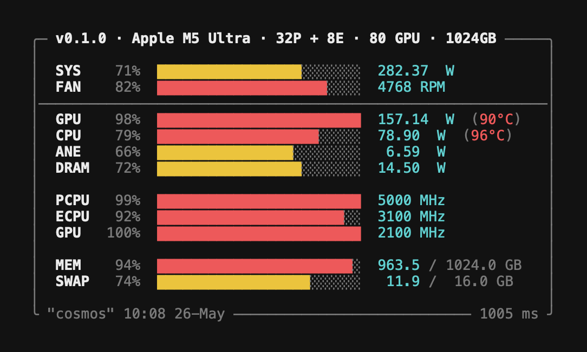

# power-monitor

Rust library and native macOS Menu Bar app (Swift) for zero-subprocess, sudoless Apple Silicon power and performance monitoring via FFI to AppleSMC, libIOReport, and IOKit.

<p align="center">
  
</p>

Reads power, temperature, fan RPM, CPU/GPU utilisation, CPU/GPU frequency, voltage, current, battery state, and RAM/swap.

No spawning external processes nor elevated privilege requirement.

## Quick start

```rust
fn main() {
    let mut sampler = power_monitor::Sampler::new().expect("failed to open subsystems");
    let m = sampler.get_metrics(1000);
    println!("CPU  {:.2} W  GPU  {:.2} W  sys {:.2} W", m.cpu_power, m.gpu_power, m.sys_power);
    println!("PCPU {:.0}% @ {} MHz", m.pcpu.utilization * 100.0, m.pcpu.freq_mhz);
    println!("RAM  {:.1} GB used", m.memory.used as f64 / 1e9);
}
```

## Subsystem overview

| Type                           | Source                            | What it provides                                                     |
| ------------------------------ | --------------------------------- | -------------------------------------------------------------------- |
| `Smc`                          | AppleSMC (IOKit)                  | Power rails, 11 temperature sensors, fans, voltage, current, battery |
| `Smc::read_per_core_cpu_temps` | AppleSMC                          | Per-core CPU temperatures (`Tp01`..`Tp0g`) as a `Vec<f32>`           |
| `EnergySampler`                | IOReport Energy Model             | Per-component watts: CPU clusters, GPU, ANE, DRAM, display, ISP      |
| `EnergyAccumulator`            | fold `EnergyReading`              | Cumulative joules + time-weighted average watts across many samples  |
| `MultiGroupSampler`            | IOReport multi-group              | Energy Model + CPU Stats + GPU Stats in one subscription handle      |
| `Sampler`                      | All of the above                  | Averaged `Metrics` snapshot over a configurable time window          |
| `SocInfo`                      | sysctl + IOKit                    | Chip name, core counts, CPU/GPU frequency tables                     |
| `read_memory` / `read_swap`    | Mach `host_statistics64` + sysctl | Physical RAM and swap file statistics                                |

## What it reads

| Domain          | Source              | Metrics                                                                                                         |
| --------------- | ------------------- | --------------------------------------------------------------------------------------------------------------- |
| Power           | SMC + IOReport      | System total (`PSTR`), SoC package (`PPBR`), CPU clusters (ECPU/PCPU), GPU, ANE, DRAM, bus                      |
| CPU/GPU util    | IOReport            | Active fraction from P-state residency histograms; weighted average frequency (MHz)                             |
| Temperature     | SMC (11 sensors)    | E-cluster, P-cluster, GPU die A/D, GPU proximity, CPU proximity, wireless, ambient, SSD, battery prox, mem ctrl |
| Fans            | SMC (up to 2)       | Actual RPM, target RPM, min/max RPM, duty cycle; zero on fanless hardware (MacBook Air)                         |
| Voltage rails   | SMC                 | 12 V supply, intermediate DC rail, CPU core VDD, GPU core VDD                                                   |
| Current sensors | SMC                 | DC rail, CPU core, GPU core                                                                                     |
| Battery         | SMC                 | Voltage (mV), current (mA), avg power (mW), remaining/full capacity (mAh), state-of-charge %, charging flag     |
| RAM             | `host_statistics64` | Total, used, available, wired, compressed (Activity Monitor formula)                                            |
| Swap            | `vm.swapusage`      | Total, used, free                                                                                               |

Battery fields are all zero on desktop hardware — check `BatteryReading::is_present()` before using.

## Fleet dashboard

Aggregate many Macs into one big-screen dashboard. Each Mac runs
`power-monitor serve --bind 0.0.0.0`; one "dashboard host" runs
`power-monitor collect --host mac01,mac02,...` which polls every agent and
serves a single HTML page plus a Server-Sent Events stream to the browser.

```bash
# On every Mac in the fleet (installs a launchd user agent):
power-monitor serve --bind 0.0.0.0 --port 9090 --install

# On the dashboard host:
power-monitor collect --host mac01.lan,mac02.lan,mac03.lan --port 8080 --install

# Point a kiosk-mode Chrome at:
http://dashboard-host:8080/
```

Endpoints on the collector:

| Path            | Content                                                    |
| --------------- | ---------------------------------------------------------- |
| `GET /`         | Embedded dashboard HTML (TUI-style tiles, one per host)    |
| `GET /stream`   | Server-Sent Events — full fleet snapshot pushed on a timer |
| `GET /snapshot` | One-shot JSON aggregate — useful for debugging with `curl` |
| `GET /metrics`  | **Aggregated Prometheus text** — every host, one scrape    |

The `/metrics` endpoint lets you point a single Prometheus target at the
collector instead of scraping every agent. Every gauge carries `chip` and
`host` labels, and a `power_monitor_host_up{target="..."}` liveness gauge
is emitted for every configured host (1 = responding, 0 = stale/offline)
so alerts can catch dead agents.

```yaml
# prometheus.yml
scrape_configs:
  - job_name: power_monitor_fleet
    static_configs:
      - targets: ["collector-host:8080"]
    metrics_path: /metrics
```

Each tile includes three **sparkline rows** showing the last 40 seconds of
SYS / CPU / GPU power draw, rendered server-side as Unicode block glyphs
(`▁▂▃▄▅▆▇█`). Sparklines stream with the SSE snapshot — no extra load on
agents, no raw history shipped over the wire.

Design notes:

- **One browser connection** regardless of fleet size. The collector polls
  agents in parallel (one thread per host, blocking I/O) and multiplexes
  into a single SSE stream.
- **Decoupled poll rates.** Agent poll interval is independent of the SSE
  push interval — high-frequency UI updates don't increase per-agent load.
- **Stale detection.** A tile fades after 3× the poll interval and marks
  offline after 10×. When an agent comes back it rejoins on the next tick.
- **Zero dependencies.** Both `serve` and `collect` use a raw `TcpListener`
  and hand-rolled HTTP/1.1 + SSE. No tokio, no frameworks.
- **Optional bearer auth.** `--auth <token>` on `serve` requires
  `Authorization: Bearer <token>` on every request; `collect` forwards the
  same token to each agent and enforces it on its own dashboard endpoint.

Per-host CPU overhead of the agent is <1% on M5 at 1 Hz sampling (the sample
path is zero-allocation after warm-up). Per-poll network traffic is ~800 bytes.

### Tailscale

Works out of the box — Tailscale is just a network layer, and the collector
speaks plain HTTP over whatever reachable address you give it. MagicDNS
resolves bare hostnames, so `--host mac01,mac02,...` just works across the
tailnet.

```bash
# On every Mac in the tailnet:
power-monitor serve --bind 0.0.0.0 --port 9090 --install

# On any tailnet node — auto-discover all online peers:
power-monitor collect --tailnet --port 8080 --install

# Or hand-pick specific hosts:
power-monitor collect \
  --host mac01,mac02,mac03,mac-studio \
  --port 8080 \
  --install

# View from any other tailnet node:
open http://collector-host:8080/
```

`--tailnet` shells out to `tailscale status` on startup, pulls every online
peer from the tabular output, and populates the host list automatically.
Adding a 26th Mac is just `tailscale up` on the new machine plus a
collector restart.

Three reasons Tailscale is _nicer_ than a flat LAN for this:

1. **Collector and viewers don't need to share a network with the Macs.**
   Dashboard can live on a basement node while you view it from a laptop on
   LTE — both just need the tailnet.
2. **ACLs do network-layer access control for free.** A policy like
   ```jsonc
   "acls": [
     { "action": "accept",
       "src":    ["tag:dashboard"],
       "dst":    ["tag:workstation:9090"] },
     { "action": "accept",
       "src":    ["group:admins"],
       "dst":    ["tag:dashboard:8080"] }
   ]
   ```
   limits who on the tailnet can reach the agents and who can view the
   dashboard. Combine with `--auth <token>` for belt-and-suspenders:
   network-layer Tailscale ACL plus app-layer bearer token.
3. **No port-forwards, VLANs, or firewall rules.** If a Mac is in the
   tailnet, it's reachable. Period.

**Binding subtlety.** `--bind 0.0.0.0` exposes on _all_ interfaces —
Tailscale, LAN, and localhost. If you want tailnet-only (so port 9090 is
literally not listening on the coffee-shop WiFi), bind to the node's
Tailscale IP specifically:

```bash
TS_IP=$(tailscale ip -4 | head -1)
power-monitor serve --bind "$TS_IP" --port 9090 --install
```

## Platform

macOS only, Apple Silicon (ARM64). Cross-compiling from x86-64 is not supported.

IOReport CPU/GPU utilisation channels require Apple Silicon; SMC keys compile on Intel Macs but many sensors will be absent.

Full SMC temperature coverage (all 11 sensors) requires macOS 14+.

## Comparison with macmon

[macmon](https://github.com/vladkens/macmon) is the closest equivalent.

| Feature                               | power-monitor                                 | macmon                          |
| ------------------------------------- | --------------------------------------------- | ------------------------------- |
| **Crate dependencies**                | Zero                                          | 8 (ratatui, serde, chrono, ...) |
| **Design intent**                     | Library first; CLI on top                     | TUI first; library on the side  |
| **Public FFI surface**                | All IOReport, IOKit, CF, SMC symbols `pub`    | All FFI private                 |
| **Battery readings**                  | Yes (voltage, current, capacity, charge %)    | No                              |
| **Voltage + current rails exposed**   | Yes (CPU/GPU VDD, 12V rail, DC rail)          | Read internally, not surfaced   |
| **Named temperature sensors**         | 11 individually addressable                   | 2 averages (CPU avg, GPU avg)   |
| **Fan support**                       | Up to 2 fans, duty cycle, dynamic count       | No fan data                     |
| **SMC key enumeration**               | Yes (`key_count`, `key_at_index`, `all_keys`) | Yes (`read_all_keys`)           |
| **Typed error handling**              | `SmcError` variants, `Result<T,E>` throughout | `Box<dyn Error>` throughout     |
| **RAII**                              | `OwnedCf` wrapper + `Drop` on all handles     | `Drop` on key types             |
| **`#[non_exhaustive]` structs**       | Yes -- forward compatible                     | No                              |
| **Unit-aware energy (mJ/uJ/nJ)**      | Yes                                           | Yes                             |
| **DVFS frequency tables**             | Yes (auto-detects Hz/kHz by magnitude)        | Yes (chip-aware scaling)        |
| **Tests**                             | 96                                            | 7                               |
| **TUI dashboard**                     | Yes                                           | Yes                             |
| **JSON pipe output**                  | Yes                                           | Yes                             |
| **HTTP + Prometheus endpoint**        | Yes                                           | Yes                             |
| **launchd auto-start**                | Yes                                           | Yes                             |
| **Historical sparklines**             | No                                            | Yes (ratatui)                   |
| **IOHID temp fallback (M1/macOS 12)** | No                                            | Yes                             |
| **Homebrew / crates.io**              | Pending                                       | Yes                             |

## Install

### Rust library / CLI

```toml
[dependencies]
power-monitor = "0.1"
```

Or build the CLI binary directly:

```bash
cargo install power-monitor
power-monitor           # live TUI dashboard
power-monitor pipe      # NDJSON metrics stream
power-monitor serve     # HTTP + Prometheus endpoint
power-monitor collect   # fleet dashboard
power-monitor doctor    # health-check the SMC/IOReport subsystems
```

`power-monitor --help` prints sectioned help; `power-monitor help <command>`
(or `power-monitor <command> --help`) drills into any subcommand. `--version`
is build-stamped (`0.1.0 (built <ts>, <git>)`).

### Menu bar app (unsigned build)

Download `PowerMonitorMenuBar-v<version>-macos-arm64.zip` from the
releases page, unzip into `/Applications`, then clear the Gatekeeper
quarantine bit:

```bash
xattr -dr com.apple.quarantine /Applications/PowerMonitorMenuBar.app
```

Left-click the menu bar bolt icon for the dashboard; right-click for Quit.
See `app/` for source. Build locally with `cd app && ./build.sh`.

## CLI Usage

### TUI

Run with no arguments for a live terminal dashboard that refreshes every second:

```
power-monitor
```

### pipe

Stream NDJSON metrics to stdout, one object per line:

```
power-monitor pipe [-s N] [-i N]
  -s, --samples   Stop after N samples (default 0 = infinite)
  -i, --interval  Sampling window in ms (default 1000)
```

Examples:

```bash
# Stream indefinitely, pretty-print with jq
power-monitor pipe | jq

# Take 10 samples at 500 ms each, write to file
power-monitor pipe -s 10 -i 500 > metrics.ndjson
```

### serve

Serve a JSON and Prometheus endpoint over HTTP:

```
power-monitor serve [--bind ADDR] [-p PORT] [-i N] [--auth TOKEN] [--install] [--uninstall]
  --bind           Bind address (default 127.0.0.1; use 0.0.0.0 for LAN)
  -p, --port       Listen port (default 9090)
  -i, --interval   Sampling interval ms (default 1000)
  --auth TOKEN     Require 'Authorization: Bearer TOKEN' on all requests
  --install        Install and start as a launchd user agent
  --uninstall      Stop and remove the launchd agent
```

Examples:

```bash
# Start the HTTP server on the default port
power-monitor serve

# Fetch a JSON snapshot
curl http://127.0.0.1:9090/json

# Fetch Prometheus metrics
curl http://127.0.0.1:9090/metrics

# Install as a persistent launchd agent (survives reboots)
power-monitor serve --install

# Remove the launchd agent
power-monitor serve --uninstall
```

For an agent reachable over the network, keep the bearer token out of `ps`
and shell history with `--auth-file` instead of `--auth`:

```bash
printf 'my-secret-token' > ~/.pm-token && chmod 600 ~/.pm-token
power-monitor serve --bind 0.0.0.0 --auth-file ~/.pm-token --install
```

On `--install` the *path* (not the token) is written into the launchd plist.

### doctor

Health-check the monitoring subsystems — handy on a fresh machine or in CI.
Exits non-zero if any critical check fails:

```
$ power-monitor doctor
  ✓ CPU architecture   Apple Silicon (aarch64)
  ✓ AppleSMC           opened; 1 fan(s), CPU 40°C / GPU 39°C
  ✓ IOReport sampler   Apple M5 · 4P+6E · 10 GPU · sys 6.50 W
```

### Shell completions & man page

Completions are generated on demand (no clap, no build step):

```bash
power-monitor completion bash > $(brew --prefix)/etc/bash_completion.d/power-monitor
power-monitor completion zsh  > ~/.zsh/completions/_power-monitor
power-monitor completion fish > ~/.config/fish/completions/power-monitor.fish
```

The man page is embedded in the binary:

```bash
power-monitor man | man -l -      # preview
power-monitor man --install       # ~/.local/share/man/man1, then `man power-monitor`
```

## Licence

Licensed under either of:

- Apache License, Version 2.0 ([LICENSE-APACHE](LICENSE-APACHE))
- MIT licence ([LICENSE-MIT](LICENSE-MIT))

at your option.
